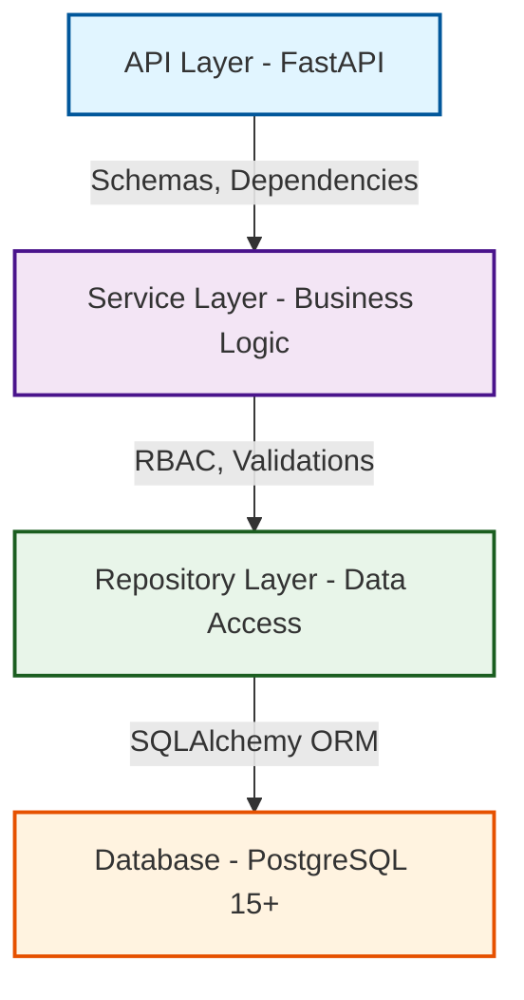

# 🛠️ Разработка

Документация для разработчиков: архитектура, тестирование, качество кода и линтеры.

---

## 🏛️ Архитектура проекта

### Структура директорий

```
mini-crm-ai-gen/
├── app/
│   ├── api/
│   │   ├── v1/                    # API v1 эндпоинты
│   │   │   ├── auth.py           # Аутентификация
│   │   │   ├── organizations.py  # Организации
│   │   │   ├── contacts.py       # Контакты
│   │   │   ├── deals.py          # Сделки
│   │   │   ├── tasks.py          # Задачи
│   │   │   ├── activities.py     # Активности
│   │   │   └── analytics.py      # Аналитика
│   │   ├── dependencies.py       # FastAPI зависимости
│   │   └── middleware.py         # Middleware (CORS, errors)
│   ├── core/
│   │   ├── config.py             # Конфигурация приложения
│   │   ├── database.py           # Настройка БД (async engine)
│   │   ├── security.py           # Хеширование паролей
│   │   ├── jwt.py                # JWT токены
│   │   ├── cache.py              # In-memory кеширование
│   │   ├── permissions/          # RBAC система
│   │   └── exceptions.py         # Пользовательские исключения
│   ├── models/                   # SQLAlchemy ORM модели
│   │   ├── user.py
│   │   ├── organization.py
│   │   ├── contact.py
│   │   ├── deal.py
│   │   ├── task.py
│   │   └── activity.py
│   ├── repositories/             # Data Access Layer
│   │   ├── base.py              # Базовый репозиторий
│   │   ├── user.py
│   │   ├── organization.py
│   │   ├── contact.py
│   │   ├── deal.py
│   │   ├── task.py
│   │   └── activity.py
│   ├── schemas/                  # Pydantic схемы
│   │   ├── user.py
│   │   ├── organization.py
│   │   ├── contact.py
│   │   ├── deal.py
│   │   ├── task.py
│   │   ├── activity.py
│   │   └── analytics.py
│   ├── services/                 # Business Logic Layer
│   │   ├── auth.py              # Сервис аутентификации
│   │   ├── organization.py      # Сервис организаций
│   │   ├── contact.py           # Сервис контактов
│   │   ├── deal.py              # Сервис сделок (с бизнес-правилами)
│   │   ├── task.py              # Сервис задач
│   │   ├── activity.py          # Сервис активностей
│   │   └── analytics.py         # Сервис аналитики
│   └── main.py                   # FastAPI приложение
├── migrations/                   # Alembic миграции
│   ├── versions/                # История миграций
│   └── env.py                   # Alembic окружение
├── tests/                        # Тесты
│   ├── unit/                    # Unit тесты
│   ├── integration/             # Интеграционные тесты
│   ├── conftest.py              # Pytest фикстуры
│   └── fixtures/                # Тестовые данные
├── docs/                         # Документация
├── .env.example                  # Пример переменных окружения
├── requirements.txt              # Python зависимости
├── requirements-dev.txt          # Дополнительные зависимости для разработки
├── docker-compose.yml            # Docker Compose конфиг
├── docker-compose.test.yml       # Тестовое окружение
├── alembic.ini                   # Alembic конфиг
├── pyproject.toml                # Конфигурация инструментов
└── README.md                     # Основная документация
```

### Слоистая архитектура

Проект использует **Clean Architecture** с четким разделением на слои:



**Принципы архитектуры:**
- ✅ Слои не смешиваются - каждый слой имеет четкую ответственность
- ✅ Dependency Injection через FastAPI - зависимости инжектируются автоматически
- ✅ Легко тестируется - можно мокировать любой слой
- ✅ Async/await везде - асинхронная обработка запросов

**Слои:**
1. **API Layer** (`app/api/`) - роуты, схемы запросов/ответов, валидация
2. **Service Layer** (`app/services/`) - бизнес-логика, правила, проверки
3. **Repository Layer** (`app/repositories/`) - доступ к данным, паттерн Repository
4. **Model Layer** (`app/models/`) - ORM модели SQLAlchemy

---

## 🗄️ Схема базы данных

### Основные таблицы

#### `users` - Пользователи
```sql
id              UUID PRIMARY KEY
email           VARCHAR UNIQUE NOT NULL
hashed_password VARCHAR NOT NULL
name            VARCHAR NOT NULL
created_at      TIMESTAMP
```

#### `organizations` - Организации
```sql
id         UUID PRIMARY KEY
name       VARCHAR NOT NULL
created_at TIMESTAMP
```

#### `organization_members` - Участники организаций
```sql
id              UUID PRIMARY KEY
organization_id UUID REFERENCES organizations
user_id         UUID REFERENCES users
role            VARCHAR (owner, admin, manager, member)
created_at      TIMESTAMP
UNIQUE(organization_id, user_id)
```

#### `contacts` - Контакты
```sql
id              UUID PRIMARY KEY
organization_id UUID REFERENCES organizations
owner_id        UUID REFERENCES users
name            VARCHAR NOT NULL
email           VARCHAR
phone           VARCHAR
created_at      TIMESTAMP
```

#### `deals` - Сделки
```sql
id              UUID PRIMARY KEY
organization_id UUID REFERENCES organizations
contact_id      UUID REFERENCES contacts
owner_id        UUID REFERENCES users
title           VARCHAR NOT NULL
amount          DECIMAL(15,2) NOT NULL
currency        VARCHAR DEFAULT 'USD'
status          VARCHAR DEFAULT 'new'
stage           VARCHAR DEFAULT 'qualification'
created_at      TIMESTAMP
updated_at      TIMESTAMP
```

#### `tasks` - Задачи
```sql
id          UUID PRIMARY KEY
deal_id     UUID REFERENCES deals
title       VARCHAR NOT NULL
description TEXT
due_date    DATE NOT NULL
is_done     BOOLEAN DEFAULT FALSE
created_at  TIMESTAMP
```

#### `activities` - Активности
```sql
id         UUID PRIMARY KEY
deal_id    UUID REFERENCES deals
author_id  UUID REFERENCES users (nullable)
type       VARCHAR NOT NULL
payload    JSONB
created_at TIMESTAMP
```

### Связи между таблицами

```
organizations ──┬─< contacts
                ├─< deals
                └─< organization_members ─< users

contacts ──< deals ──┬─< tasks
                     └─< activities
```

---

## 🧪 Тестирование

### Структура тестов

```
tests/
├── unit/                          # Unit тесты
│   ├── test_permissions.py       # Тесты RBAC
│   ├── test_security.py          # Тесты безопасности
│   └── test_jwt.py               # Тесты JWT
├── integration/                   # Интеграционные тесты
│   ├── test_auth_api.py          # Тесты аутентификации
│   ├── test_contacts_api.py      # Тесты API контактов
│   ├── test_deals_api.py         # Тесты API сделок
│   ├── test_tasks_api.py         # Тесты API задач
│   ├── test_organizations_api.py # Тесты API организаций
│   ├── test_activities_api.py    # Тесты API активностей
│   ├── test_analytics_api.py     # Тесты API аналитики
│   └── test_full_scenario_e2e.py # E2E тесты
├── fixtures/                      # Тестовые данные
└── conftest.py                    # Pytest фикстуры
```

### Запуск тестов

#### Локальный запуск

```bash
# Запустить все тесты
pytest

# С покрытием кода
pytest --cov=app --cov-report=term-missing --cov-report=html

# Только unit тесты
pytest tests/unit/

# Только интеграционные тесты
pytest tests/integration/

# Конкретный файл
pytest tests/unit/test_permissions.py

# Конкретный тест
pytest tests/unit/test_permissions.py::test_permission_check

# С подробным выводом
pytest -v

# С выводом print
pytest -s

# Остановиться на первой ошибке
pytest -x

# Параллельный запуск (требуется pytest-xdist)
pytest -n auto
```

#### Docker-тесты

```bash
# Запуск тестов в изолированном окружении
docker-compose -f docker-compose.test.yml up --build --abort-on-container-exit

# Только сборка тестового образа
docker-compose -f docker-compose.test.yml build

# Очистка после тестов
docker-compose -f docker-compose.test.yml down -v

# Запуск с просмотром логов
docker-compose -f docker-compose.test.yml up --build
```

### Типы тестов

#### Unit тесты

Изолированное тестирование бизнес-логики без зависимости от БД или API:

- Проверка бизнес-правил (правила перехода статусов, ролей)
- Валидация данных
- Логика сервисов
- Функции безопасности (хеширование паролей, JWT)

**Пример:**
```python
def test_permission_check():
    user = User(id=uuid4(), role=Role.MEMBER)
    assert has_permission(user, Permission.READ_CONTACTS)
    assert not has_permission(user, Permission.DELETE_ORGANIZATION)
```

#### Интеграционные тесты

Тестирование API через HTTP запросы с использованием TestClient:

- HTTP запросы через TestClient
- Проверка статус-кодов и форматов ответов
- Проверка RBAC на уровне API
- Взаимодействие с реальной БД (тестовая)

**Пример:**
```python
def test_create_contact(client, auth_headers):
    response = client.post(
        "/api/v1/contacts",
        json={"name": "Test", "email": "test@example.com"},
        headers=auth_headers
    )
    assert response.status_code == 201
    assert response.json()["name"] == "Test"
```

#### E2E тесты

Полный сценарий работы приложения:

1. Регистрация пользователя
2. Создание организации
3. Добавление участников
4. Создание контактов
5. Создание сделок
6. Создание задач
7. Изменение статусов
8. Проверка аналитики

**Пример:**
```python
def test_full_workflow(client):
    # 1. Регистрация
    user = register_user(client, "test@example.com")
    # 2. Создание контакта
    contact = create_contact(client, user)
    # 3. Создание сделки
    deal = create_deal(client, user, contact)
    # 4. Проверка аналитики
    analytics = get_analytics(client, user)
    assert analytics["by_status"]["new"]["count"] == 1
```

---

## 🎨 Качество кода и линтеры

Проект включает полный набор инструментов для контроля качества кода, настроенных в `pyproject.toml`.

### MyPy - проверка типов

Проверка статической типизации для всех модулей:

```bash
# Проверить весь проект
mypy app/

# Конкретный модуль
mypy app/services/

# С подробным выводом ошибок
mypy --show-error-codes app/

# Игнорировать отсутствующие импорты (для внешних библиотек)
mypy --ignore-missing-imports app/

# Строгий режим (включен по умолчанию)
mypy --strict app/
```

**Конфигурация в `pyproject.toml`:**
```toml
[tool.mypy]
python_version = "3.11"
strict = true
warn_return_any = true
```

### Black - форматирование кода

Автоматическое форматирование кода по стандарту PEP 8:

```bash
# Отформатировать все файлы
black app/ tests/

# Проверка без изменений (для CI)
black --check app/

# Показать diff (что будет изменено)
black --diff app/

# Конкретный файл
black app/main.py

# С указанием длины строки
black --line-length 100 app/
```

**Конфигурация в `pyproject.toml`:**
```toml
[tool.black]
line-length = 100
target-version = ['py311']
```

### Ruff - быстрый линтер

Очень быстрый линтер для Python, заменяет flake8, pylint и другие:

```bash
# Проверка всего проекта
ruff check app/

# Автоматическое исправление
ruff check --fix app/

# Проверка конкретных правил (E=errors, F=pyflakes, I=isort)
ruff check --select E,F,I app/

# Игнорировать конкретные правила
ruff check --ignore E501 app/

# Показать все доступные правила
ruff rule --all
```

**Конфигурация в `pyproject.toml`:**
```toml
[tool.ruff]
line-length = 100
target-version = "py311"
```

### isort - сортировка импортов

Автоматическая сортировка импортов по PEP 8:

```bash
# Отсортировать импорты
isort app/ tests/

# Проверка без изменений (для CI)
isort --check-only app/

# Показать diff (что будет изменено)
isort --diff app/

# С профилем black (совместимость)
isort --profile black app/

# Конкретный файл
isort app/main.py
```

**Конфигурация в `pyproject.toml`:**
```toml
[tool.isort]
profile = "black"
line_length = 100
```

### Запуск всех проверок

Скрипт для последовательного запуска всех проверок:

```bash
# Последовательный запуск всех проверок
mypy app/ && \
ruff check app/ && \
black --check app/ && \
isort --check-only app/ && \
pytest --cov=app
```

Или создать скрипт `scripts/check_quality.sh`:

```bash
#!/bin/bash
set -e

echo "🔍 Запуск проверок качества кода..."

# Форматирование
echo "📝 Форматирование кода..."
black app/ tests/
isort app/ tests/

# Линтинг
echo "🔎 Проверка линтером..."
ruff check --fix app/

# Типы
echo "🔬 Проверка типов..."
mypy app/

# Тесты
echo "🧪 Запуск тестов..."
pytest --cov=app

echo "✅ Все проверки пройдены!"
```

Сделайте скрипт исполняемым:
```bash
chmod +x scripts/check_quality.sh
./scripts/check_quality.sh
```

### Pre-commit hook

Автоматическая проверка перед каждым коммитом:

Создайте `.git/hooks/pre-commit`:

```bash
#!/bin/bash
set -e

echo "🔍 Запуск проверок качества кода..."

# Форматирование
echo "📝 Форматирование кода..."
black app/ tests/
isort app/ tests/

# Линтинг
echo "🔎 Проверка линтером..."
ruff check --fix app/

# Типы
echo "🔬 Проверка типов..."
mypy app/

# Тесты
echo "🧪 Запуск тестов..."
pytest

echo "✅ Все проверки пройдены!"
```

Сделайте его исполняемым:
```bash
chmod +x .git/hooks/pre-commit
```

> 💡 **Совет:** Для более удобной работы с pre-commit hooks используйте [pre-commit framework](https://pre-commit.com/)

### Конфигурация инструментов

Все настройки находятся в `pyproject.toml`:

```toml
[tool.black]
line-length = 100
target-version = ['py311']

[tool.isort]
profile = "black"
line_length = 100

[tool.mypy]
python_version = "3.11"
strict = true
warn_return_any = true
warn_unused_configs = true

[tool.ruff]
line-length = 100
target-version = "py311"

[tool.pytest.ini_options]
testpaths = ["tests"]
python_files = ["test_*.py"]
python_classes = ["Test*"]
python_functions = ["test_*"]
```

---

## 🔧 Разработка

### Настройка окружения

1. Создайте виртуальное окружение:
```bash
python -m venv venv
source venv/bin/activate  # Linux/macOS
# или
venv\Scripts\activate  # Windows
```

2. Установите зависимости:
```bash
pip install -r requirements.txt
pip install -r requirements-dev.txt
```

3. Настройте переменные окружения:
```bash
cp .env.example .env
# Отредактируйте .env файл
```

4. Примените миграции:
```bash
alembic upgrade head
```

5. Запустите приложение:
```bash
uvicorn app.main:app --reload
```

### Создание миграций

```bash
# Автоматическое создание миграции на основе изменений моделей
alembic revision --autogenerate -m "Описание изменений"

# Создание пустой миграции
alembic revision -m "Описание изменений"

# Применить миграции
alembic upgrade head

# Откатить миграцию
alembic downgrade -1

# Просмотреть историю миграций
alembic history

# Просмотреть текущую версию
alembic current
```

### Стиль кода

- **Длина строки:** 100 символов
- **Типизация:** Строгая типизация с type hints
- **Docstrings:** Google style docstrings (опционально)
- **Именование:** PEP 8 (snake_case для функций и переменных, PascalCase для классов)

### Git workflow

1. Создайте ветку для новой функции:
```bash
git checkout -b feature/amazing-feature
```

2. Внесите изменения

3. Запустите проверки качества:
```bash
./scripts/check_quality.sh
```

4. Закоммитьте изменения:
```bash
git commit -m "feat: Add amazing feature"
```

5. Отправьте в удаленную ветку:
```bash
git push origin feature/amazing-feature
```

6. Откройте Pull Request

### Стиль коммитов

Используйте [Conventional Commits](https://www.conventionalcommits.org/):

- `feat:` - новая функциональность
- `fix:` - исправление бага
- `docs:` - изменения в документации
- `style:` - форматирование кода
- `refactor:` - рефакторинг
- `test:` - добавление тестов
- `chore:` - обновление зависимостей, конфигурации

**Примеры:**
```bash
git commit -m "feat: Add user profile endpoint"
git commit -m "fix: Resolve pagination issue in contacts API"
git commit -m "docs: Update API documentation"
```

---

## 📚 Дополнительные ресурсы

- [FastAPI Documentation](https://fastapi.tiangolo.com/)
- [SQLAlchemy 2.0 Documentation](https://docs.sqlalchemy.org/en/20/)
- [Pydantic Documentation](https://docs.pydantic.dev/)
- [Pytest Documentation](https://docs.pytest.org/)
- [Alembic Documentation](https://alembic.sqlalchemy.org/)

